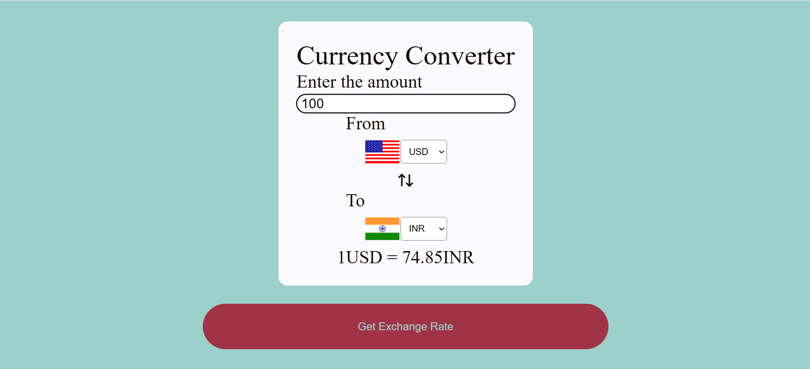

# currency_converter
# 🌍 Currency Converter Web App

A simple and responsive Currency Converter web application that allows users to convert one currency to another using real-time exchange rates from an open API.

## 🚀 Features

- Convert any amount between major currencies (USD, EUR, INR, GBP, etc.)
- Live exchange rates using [Fawaz Ahmed's Currency API](https://github.com/fawazahmed0/currency-api)
- Flag icons automatically update based on selected currencies
- Input validation for amount field
- Clean and responsive UI with dynamic dropdowns

## 📸 Preview

 <!-- Replace with actual screenshot if available -->

## 🛠️ Tech Stack

- HTML5
- CSS
- JavaScript
- [Remix Icons](https://remixicon.com/)
- [Flags API](https://flagsapi.com)
- [Fawaz Currency API](https://github.com/fawazahmed0/currency-api)

## 📦 API Used

**Fawaz Currency API (No API key needed)**  
Example URL used:
https://cdn.jsdelivr.net/npm/@fawazahmed0/currency-api@latest/v1/currencies/{from}.json
- Replace `{from}` with the base currency (e.g. `usd`)
- Example:  
  To get USD → INR:  
  `https://cdn.jsdelivr.net/npm/@fawazahmed0/currency-api@latest/v1/currencies/usd.json`

---

## 📁 Project Structure
Currency-Converter/ 
├── index.html # Main HTML file 
├── style.css # Styling 
├── script.js # Main JS logic (flag, API call, converter) 
├── countryList.js # Country-to-code mapping (for flags) 
├── README.md # You're here

---

## ⚙️ How It Works

1. User enters an amount to convert
2. Selects the **From** and **To** currencies
3. The app fetches live exchange rate from the currency API
4. Displays the result in a readable format
5. Automatically shows the appropriate country flags

---

## 🔧 Setup Instructions

1. Clone the repo or download the files
2. Open `index.html` in your browser
3. Enjoy converting currencies!

---

## 📌 To Improve (Optional Ideas)

- Add support for more currencies dynamically
- Add currency flip/swap button
- Show conversion history
- Mobile responsiveness enhancements
- Add loading animation when fetching exchange rate

---

## 🙌 Credits

- [Fawaz Ahmed Currency API](https://github.com/fawazahmed0/currency-api)
- [Flags API](https://flagsapi.com)
- [Remix Icons](https://remixicon.com)

---

## 📄 License

This project is open-source and free to use for learning and personal projects.
